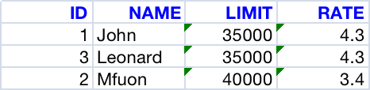

#excel generator



#### pom dependencies

```
<dependency>
<groupId>org.apache.poi</groupId>
<artifactId>poi</artifactId>
<version>3.9</version>
</dependency>

<dependency>
<groupId>org.apache.poi</groupId>
<artifactId>poi-ooxml</artifactId>
<version>3.9</version>
</dependency>

```

#### header styling

```java
        String[] columns = {"ID","NAME","LIMIT","RATE"};
        XSSFFont headerFont = workbook.createFont();
        headerFont.setBold(true);
        headerFont.setColor(IndexedColors.BLUE.getIndex());

        CellStyle headerCellStyle = workbook.createCellStyle();
        headerCellStyle.setFont(headerFont);
        headerCellStyle.setAlignment((short) 3);
        // Header
        for (int col = 0; col < columns.length; col++) {
            Cell cell = row.createCell(col);
            cell.setCellValue(columns[col]);
            cell.setCellStyle(headerCellStyle);
        }
```

#### other cells

```java
        CreationHelper createHelper = workbook.getCreationHelper();
        CellStyle numberCellStyle = workbook.createCellStyle();
        numberCellStyle.setAlignment((short) 3);
        numberCellStyle.setDataFormat(createHelper.createDataFormat().getFormat("#"));
```
